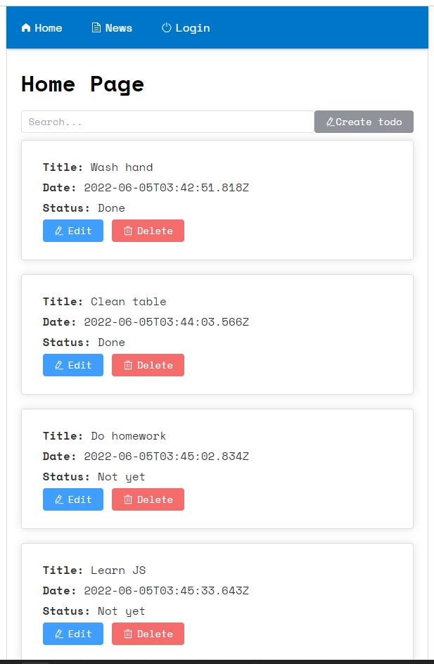
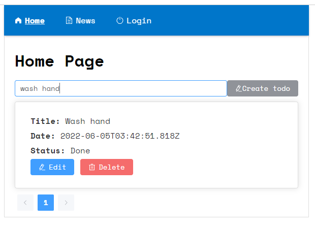
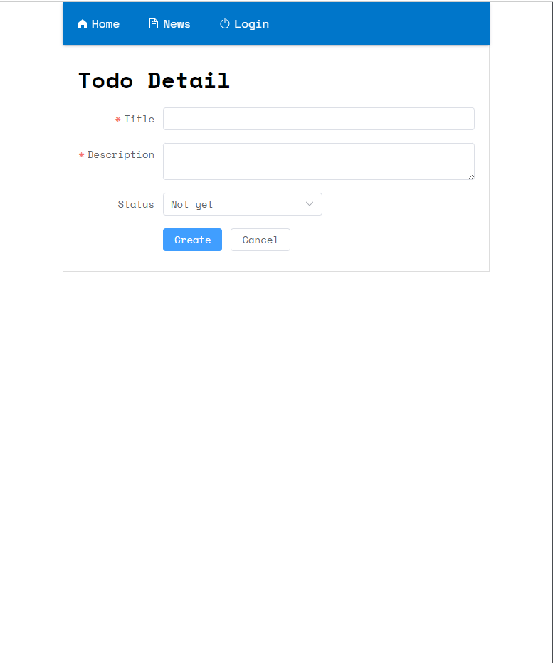
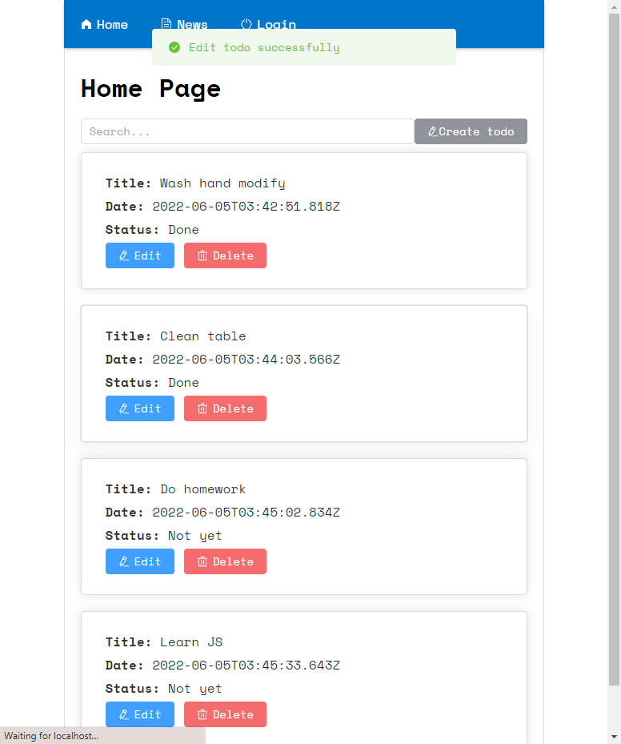
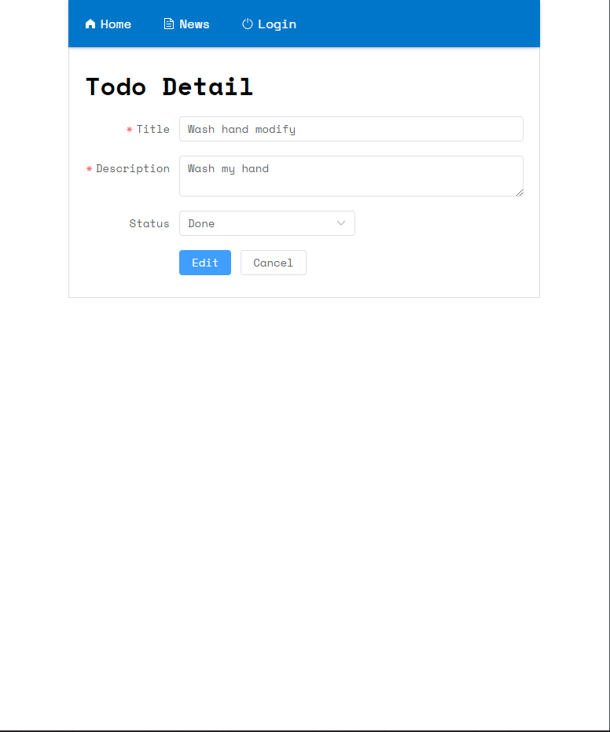

# Todo App

## Overview:
- This is the Vue app which I use vite config instead of using webpack. It really faster in build and hrm with esm.
- Basic feature:
  - Show todos
  - Search todo lazy load
  - Edit, Create todos

- Some useful config
  - Test with vitest, chai, sinon, vue util test
  - eslint
  - prettier (I removed but you can find that in some commit)

## Start source
First, you need to install node_modules

``
npm i
``

Then, Run database json-server

``
npm run db
``

Finally, Run app

``
npm run dev
``

[Optional] Run eslint, auto fix some errors, but some cases you may have to mannually fix by yourself

``
npm run lint
``

[Optional] Run test

``
npm run test:unit
``

## Requirement

Node 14

## Result

